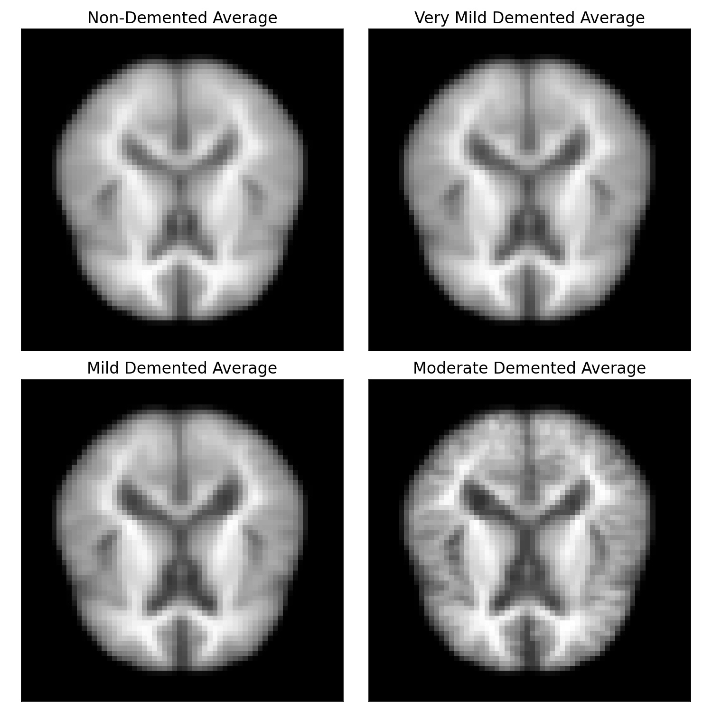
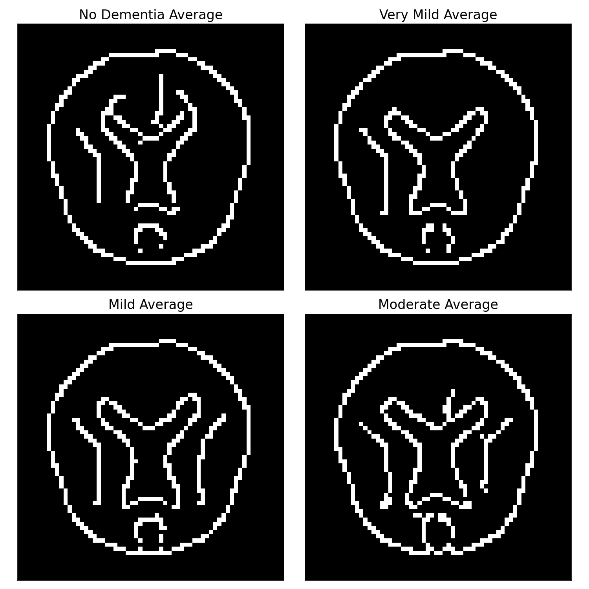
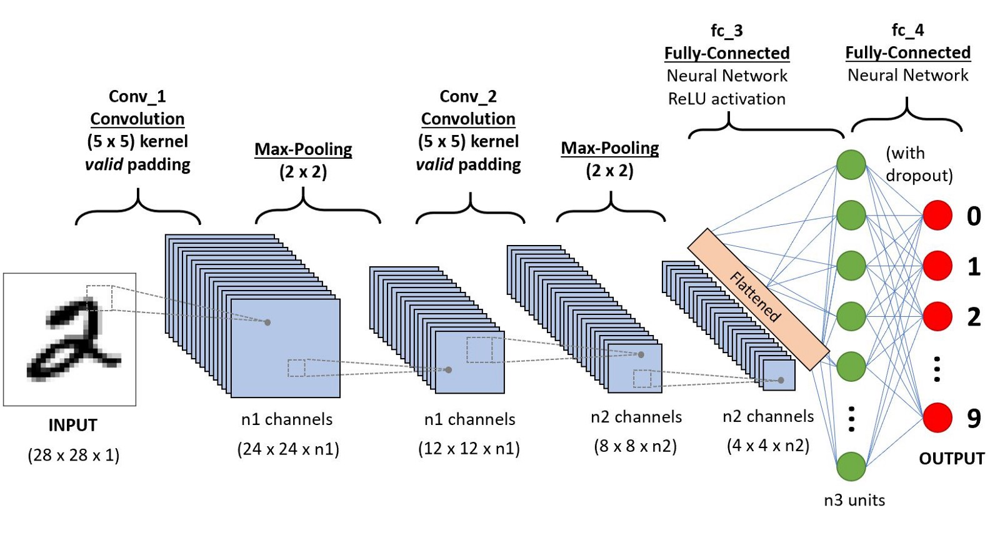

# Forget-Me-Not-Alzheimer-s-Image-Analysis-Using-A-CNN
By: Kelly Stevens 

# Table of Contents
1. [Background & Motivation](#Background-&-Motivation)
2. [The Data](#The_Data)
3. [EDA](#EDA)
4. [Convolutional Neural Networks](#Convolutional-Neural-Networks)
5. [Modeling](#Tuning_and_Model-Evaluation)
6. [Conclusions](#Conclusions)
7. [Considerations](#Considerations)

# Background & Motviation
Alzheimer’s disease is currently ranked as the sixth leading cause of death in the US. Characterized by atrophy and neural cell death it is currently affecting 5.4 million Americans. 
This disease is not just a plague to the elderly, there is early onset Alzheimer’s too. By 2050, it is estimated that the disease will affect an additional 13.8 million Americans. 

With an explosion of a neurodegenerative disease this could have great implications on society from straining the healthcare system, lack of patient care, strain on personal finances and government finances, and even a demand for real estate to build secure nursing homes. 

Having the assistance of a computer-generated model to help screen MRI imaging could have great benefits from supporting the clinician to enabling treatment sooner. Therefore, I want to know can we train a deep neural network to predict Alzheimer’s?

# The Data
Kaggle offers an [Alzheimer's Dataset](https://www.kaggle.com/tourist55/alzheimers-dataset-4-class-of-images) featuring 4 stages of MRI images split into training as well as test sets. These files are stored as a jpg image file. 

The training data set includes:
* No Dementia- 2,560 images
* Very Mild Dementia - 1,792 images
* Mild Dementia - 717 images
* Moderate Demented - 52 images

The test data set includes:
* No Dementia - 640 images
* Very Mild Dementia - 448 images
* Mild Dementia - 179 images
* Moderate Demented - 12 images

 

  

# EDA

Now that we have an understanding of what the data exactly is I would like to take averages of the data subsets in order to distinguish if there are key differences of the means. These images were resized from their original 206x178 to 64x64. 
 

  

Taking the mean values of the data I applied several filters and a contrast map between the images. The most noticeable and interpretable image to visually see our differences was the canny filter. The filter thresholds I used to achieve this image was sigma=2, low_threshold=.1, high_threshold=.4.
 

 

# Convolutional Neural Network 
Neural Networks are a subset of machine learning and are at the heart of deep learning algorithms. Convolutional neural networks (CNN) are distinguished from other neural networks by their superior performance with image, speech, or audio inputs. Since we are using two sets of images for this model it can be considered image classification. I felt that this graph gives a nice representation as to what goes on inside a CNN.

# Modeling 
## **Training / Testing**
The updated version of tensorflow (tf) makes it incredibly easy to call in your data, classify it, and set the features you decide. The images are already the model was able to infer the classes. 

I defined the following parameters for my data: 
* Image Size = 64x64
* Batch Size = 32
* Epochs = 100
* Training/Validation Split = .20

It is recommended to use smaller image sizes for computational efficiency as well as a 80/20 split for the training data so it can be tested and validated prior to running my test data.

## **Model Selection**
Prior to my layers I rescaled the data using a "Rescaling 1/255" so the data will be between 0 and 1.
Next, I used five convolutional blocks comprised of convolutional layer, max-pooling, and batch normalization.  A flatten layer followed the blocks followed by three fully connected layers. Inbetween the Dense layers was a dropout to reduce over-fitting. I stayed consistent with Relu as my activation function until my last activation function where I used softmax.

### **Hyperparameters**
* Optimizer: Adam 
* Loss: Binary Crossentropy 
* Metrics: Recall, False Negatives, Precision, Accuracy
* Epoch: 10

I focused on minimizing false negatives therefore I looked at recall. 

### **Results** 
|  Test Data       |  Rate  
| --------------- |-------:|
| Test recall     | 0.54   | 

 

# Conclusions 
My model produced a recall score of 0.54 on my test data. Since we have 4 classifications this figure is 2x better than random chance, but there is still some room for improvement.

Ultimately, Alzheimer's is not generally diagnoses solely from a MRI, but a combination of patient history, cognitive tests, blood and urine analysis. To the naked eye many of these classes can begin looking very similar. However, because the algorithm was able to accurately identify the majority between Very Mild and No Dementia there is hope with further training and model tweaking that it could predict better.

# Considerations
Although my model performed 2x better than chance I would still like to alter some features that may have an impact on the results. These features would include further work with image generation, weights, thresholds, and image segmentation.

# Citations 
Data - 
[Kaggle - Alzheimer's Dataset (4 Class of Images)](https://www.kaggle.com/tourist55/alzheimers-dataset-4-class-of-images)

CNN Image  - 
[CNN Image](https://www.kaggle.com/tourist55/alzheimers-dataset-4-class-of-images)
