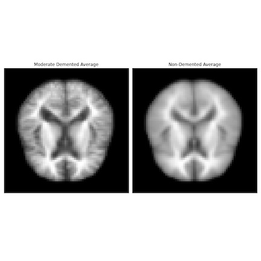

# Forget-Me-Not-Alzheimer-s-Image-Analysis-Using-A-CNN

# Table of Contents
1. [Objective](#Objective)
2. [Background & Motivation](#Background-&-Motivation)
3. [The Data](#The_Data)
4. [EDA](#EDA)
5. [Machine Learning Analysis](#Machine-Learning-Analysis)
6. [Tuning and Model Evaluation](#Tuning_and_Model-Evaluation)
7. [Results](#Results)

# Objective 
By utilizing a convolutional neural network can we predict demented brains from non-demented brains by processing Alzheimer’s MRI image dataset?

# Background & Motviation
Alzheimer’s disease is currently ranked as the sixth leading cause of death in the United States affecting roughly 5.4 million Americans, yet this number is expected to increase by 13.8 million by 2050 as the population ages. Alzheimer’s is the most common form of dementia which is characterized in memory loss due to amyloid plaque accumulation in the brain. 

Although many consider this disease to only affect the elderly, there is also early onset. Even more Alzheimer’s begins long before any symptoms become apparent. Atrophy and neural cell death are the cause the of the symptoms and medical imaging may be able to help us anticipate and begin treating this disease sooner. Having several family members succumb to this disease I want to know how we can help others potentially escape or delay the same fate?

# The Data
Kaggle offers an [Alzheimer's Dataset](https://www.kaggle.com/tourist55/alzheimers-dataset-4-class-of-images) featuring 4 stages of MRI images split into training as well as test sets. These files are stored as a jpg image file. For this study, I have selected the Moderate and Non-Demented images. 

The training data set includes:
* Non-Demented - 2,560 images
* Moderate Demented - 52 images

The test data set includes:
* Non-Demented - 640 images
* Moderate Demented - 12 images

# Exploratory Data Analysis

Now that we have an understanding of what the data exactly is. I would like to take averages of the data subsets to be able to distinguish if there are key differences of the means. These images were resized from their original 206x178 to 64x64. 

I analyzed multiple filters through skimage with the best filter being a canny filter to show the most significant difference. The filter thresholds I used to achieve this image was sigma=2, low_threshold=.1, high_threshold=.4.

# Machine Learning Analysis
