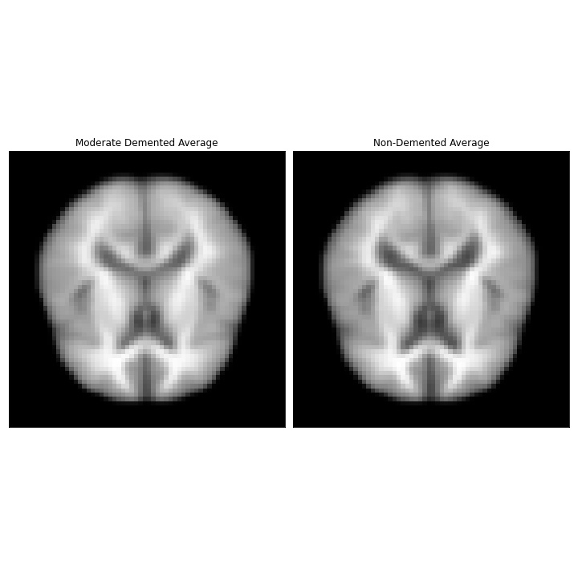
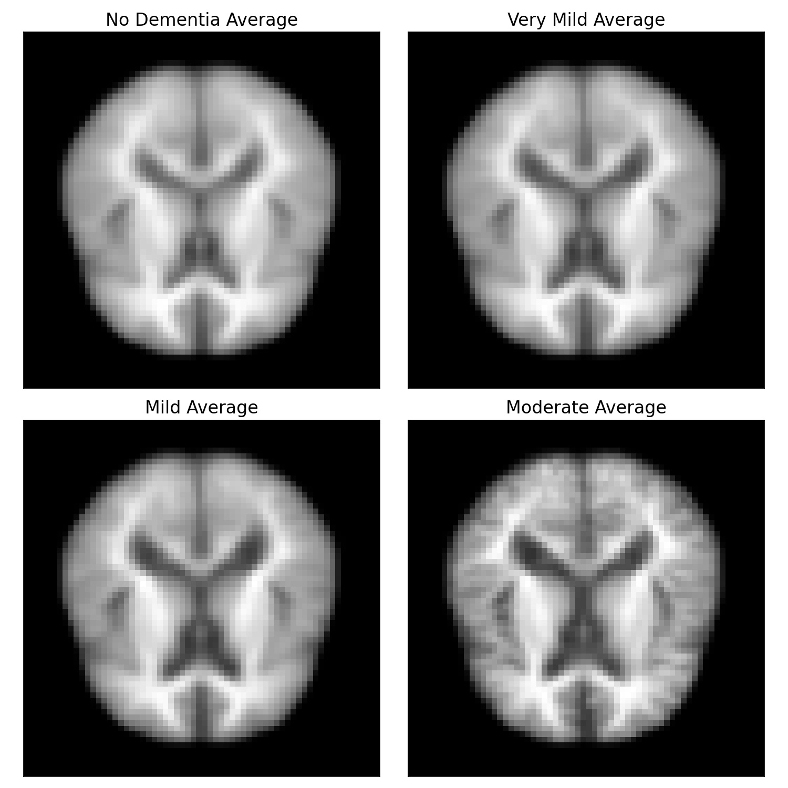
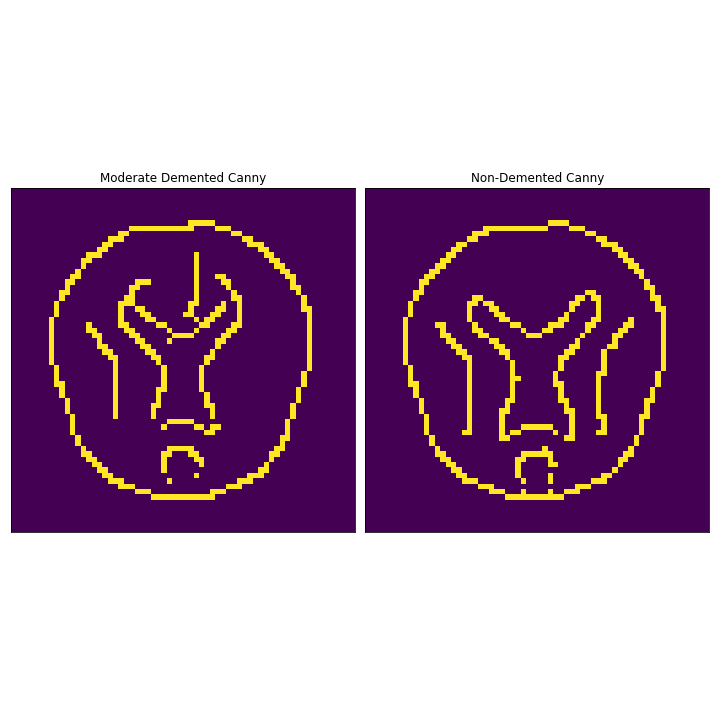

# Forget-Me-Not-Alzheimer-s-Image-Analysis-Using-A-CNN
By: Kelly Stevens 

# Table of Contents
1. [Background & Motivation](#Background-&-Motivation)
2. [The Data](#The_Data)
3. [EDA](#EDA)
4. [Convolutional Neural Networks](#Convolutional-Neural-Networks)
5. [Modeling](#Tuning_and_Model-Evaluation)
6. [Conclusions](#Conclusions)
7. [Considerations](#Considerations)

# Background & Motviation
Alzheimer’s disease is currently ranked as the sixth leading cause of death in the US. Characterized by atrophy and neural cell death it is currently affecting 5.4 million Americans. 
This disease is not just a plague to the elderly, there is early onset Alzheimer’s too. By 2050, it is estimated that the disease will affect an additional 13.8 million Americans. 

With an explosion of a neurodegenerative disease this could have great implications on society from straining the healthcare system, lack of patient care, strain on personal finances and government finances, and even a demand for real estate to build secure nursing homes. 

Having the assistance of a computer-generated model to help screen MRI imaging could have great benefits from supporting the clinician to enabling treatment sooner. Therefore, I want to know can we train a deep neural network to predict Alzheimer’s?

# The Data
Kaggle offers an [Alzheimer's Dataset](https://www.kaggle.com/tourist55/alzheimers-dataset-4-class-of-images) featuring 4 stages of MRI images split into training as well as test sets. These files are stored as a jpg image file. For this study, I have selected the Moderate and Non-Demented images. 

The training data set includes:
* Non-Demented - 2,560 images
* Moderate Demented - 52 images

The test data set includes:
* Non-Demented - 640 images
* Moderate Demented - 12 images

 

  

# EDA

Now that we have an understanding of what the data exactly is I would like to take averages of the data subsets in order to distinguish if there are key differences of the means. These images were resized from their original 206x178 to 64x64. 
 

  

Taking the mean values of the data I applied several filters and a contrast map between the images. The most noticeable and interpretable image to visually see our differences was the canny filter. The filter thresholds I used to achieve this image was sigma=2, low_threshold=.1, high_threshold=.4.
 

 

I also used KMeans cluster to analyze the clustering between the brains. As clustering increased so did the visual differences. Due to the resizing the maximium clusters I could select was 64.

# Convolutional Neural Network 
Neural Networks are a subset of machine learning and are at the heart of deep learning algorithms. Convolutional neural networks (CNN) are distinguished from other neural networks by their superior performance with image, speech, or audio inputs. Since we are using two sets of images for this model it can be considered image classification. I felt that this graph gives a nice representation as to what goes on inside a CNN.

# Modeling 
## **Training / Testing**
The updated version of tensorflow (tf) makes it incredibly easy to call in your data, classify it, and set the features you decide. The images are already labeled "NonDemented" or "ModerateDemented" and the inferred feature of the tf method is set automatically to inferred. Therefore, the model will be able to extract this information while training. 

I defined the following parameters for my data: 
* Image Size = 64x64
* Batch Size = 32
* Epochs = 10
* Training/Validation Split = .20

It is recommended to use smaller image sizes for computational efficiency as well as a 80/20 split for the training data so it can be tested and validated prior to running my test data.

## **Model Selection**
Prior to my layers I rescaled the data using a "Rescaling 1/255" so the data will be between 0 and 1.
Next, I used four convolutional blocks comprised of convolutional layer, max-pooling, and batch normalization. Next, I placed a flatten layer and followed it by three fully connected layers. It between the Dense layers was a dropout to reduce over-fitting. I stayed consistent with Relu as my activation function until my last activation function where I used Sigmoid since this is a binary classification. 

### **Hyperparameters**
* Optimizer: Adam 
* Loss: Binary Crossentropy 
* Metrics: Recall, False Negatives, Precision, Accuracy
* Epoch: 10

Recall was the most important cost measure I wanted to focus on. The logic behind this reasoning that when dealing with middle stage dementia (moderate) and no dementia the majority of patients will already be experiencing symptoms and will have an understanding something is going on. Therefore, it is more important to identify and minimize the false negatives. Tensorflow also has a metric called "False Negative" that I also included in the function to see how it performed.

### **Results** 
|  Test Data       |  Rate  
| --------------- |-------:|
| Test accuracy   |	0.98   |
| Test recall     | 1.00   | 
| Test precision  | 0.98   | 
| Test False Negatives | 0.00 | 
| Test loss         | 0.11   | 

 

# Conclusions 

I performed a simple CNN model and a more complex model with my data, and both performed well. The model was able to learn quite quickly and correct it's learning through a minimal number of epochs. While deep learning is a very powerful tool, and it was great to see first-hand it's power to find a pattern within the data provided I am skeptical to my findings. 

Due to my extreme imbalance in data, I would be remiss to not consider this is a product of that. Tuning my hyperparameters had some impact such as moving into Categorical Crossentropy, etc. The takeaway from this is that neural networks and CNN do have the ability to support predictions of Alzheimer's. However, more work is necessary to do to the dataset and model. 

# Considerations
To further this project, my next steps would be to include the remaining two subsets of images. I anticipate tuning the hyperparameters now since it will no longer be a binary classification, but categorical. I also anticipate I should need to include a learning rate, model checkpoint, and early stopping. I did not feel it was necessary in this case since the model performed well, potentially too well. 

I would also like to review the subsets of data and ensure that any imbalances be corrected using an Image Generator tool tensorflow provides. Lastly, since the next dataset will be larger it could be more computationally expensive and I would like to run an EC2 instance off AWS. 

# Citations 
Data - 
[Kaggle - Alzheimer's Dataset (4 Class of Images)](https://www.kaggle.com/tourist55/alzheimers-dataset-4-class-of-images)

CNN Image  - 
[CNN Image](https://www.kaggle.com/tourist55/alzheimers-dataset-4-class-of-images)
